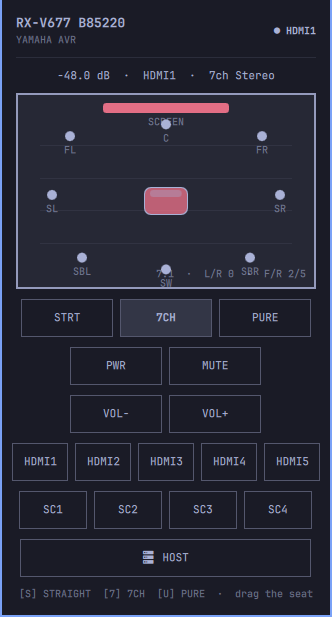

# Yamaha AVR for Omarchy

A keyboard-first remote for the Omarchy Quattro bar. It talks **YNCA** — Yamaha's
HTTP XML protocol on port 80 — the same path the old AV Controller phone app
uses on 2010–2014 receivers.

This is **not** MusicCast. If `http://RECEIVER/YamahaRemoteControl/desc.xml`
loads, this plugin can talk to the box.



## Supported devices

Anything with the **Yamaha Network Control** HTTP API
(`/YamahaRemoteControl/ctrl`). That is typical of 2010–2014 **RX-V**, **RX-A
(AVENTAGE)**, and **HTR** receivers. Later MusicCast units often still expose
YNCA; this plugin only uses that older API.

### RX-V / RX-A years that speak YNCA

| Year | RX-V | AVENTAGE | Other |
| --- | --- | --- | --- |
| 2014 | RX-V477, RX-V677, RX-V777, RX-V1077, RX-V2077, RX-V3077 | RX-A740, RX-A840, RX-A1040, RX-A2040, RX-A3040 | |
| 2013 | RX-V475, RX-V575, RX-V675, RX-V775, RX-V1075, RX-V2075, RX-V3075 | RX-A730–A3030 | HTR-4066 |
| 2012 | RX-V473, RX-V573, RX-V673, RX-V773 | RX-A720–A3020 | HTR-4065, HTR-7065 |
| 2011 | RX-V671, RX-V771, RX-V871, RX-V1071, RX-V2071, RX-V3071 | RX-A710–A3010 | HTR-6064 |
| 2010 | RX-V867, RX-V1067, RX-V2067, RX-V3067 | RX-A700–A3000 | HTR-8063 |

### Tested here

- Yamaha **RX-V677** (2014, 7.2, network name `RX-V677 B85220`)

### Not this plugin

| Device | Why |
| --- | --- |
| MusicCast speakers, WX/WX-series, MusicCast 20/50 | Different API (`/YamahaExtendedControl/`) |
| 2020+ RX-V6A / RX-A2A / RX-A4A and similar | Prefer MusicCast; YNCA may still answer but is untested |
| Non-Yamaha AVRs | |

## Features

- Bar chip labelled **AV**
- Power, mute, and volume (absolute dB on RX-V677; `Val=Up` is rejected)
- HDMI 1–5 and scenes 1–4
- Straight, 7ch Stereo, and Pure Direct
- Draggable 7.1 seat map:
  - **Left / right** writes per-speaker level trims (`Speaker_Preout` Pattern 1).
    Center of the map is the receiver's current calibration (YPAO). Dragging
    back to the middle restores it.
  - **Front / back** is Dialogue Lift (0–5)
- Dedicated **Audio Controls** view:
  - **Bass & Treble** tone controls (-6.0 dB to +6.0 dB in 0.5 dB steps) with quick 0 dB reset
  - **Subwoofer Trim** (-6.0 dB to +6.0 dB in 0.5 dB steps) with quick 0 dB reset
  - **Dialogue Level** (0–3) and **Dialogue Lift** (0–5) selectors
  - **DSP Processing toggles**: Extra Bass, YPAO Volume, Adaptive DRC, Enhancer, and Cinema DSP 3D

## Requirements

- Omarchy Quattro
- Python 3.9 or newer (stdlib only — no pip, no venv)
- A Yamaha receiver on the LAN with Network Standby on if you want it reachable
  from sleep

The plugin runs unsandboxed inside `omarchy-shell`. Review the repository
before installing it.

## Install

```bash
omarchy plugin add https://github.com/bjarkimg/omarchy-yamaha-avr.git --enable
```

Open the **AV** chip, press **D**, enter the receiver IP, and connect. Network
name is read from the box after the first successful GET.

## Controls

| Key | Action |
| --- | --- |
| O | Power On |
| X | Power Off / Standby |
| P | Power Toggle |
| M | Mute |
| - / + | Volume |
| 1–5 | HDMI 1–5 |
| S | Straight |
| 7 | 7ch Stereo |
| U | Pure Direct |
| A | Audio controls view |
| D | Receiver host settings |
| B | Back to remote (from Audio or Host view) |
| Q or Escape | Close / Back |

- **Bar chip (AV):** Left-click opens/closes the panel. Right-click or middle-click toggles power directly.
- **Remote buttons:** Dedicated **ON**, **OFF**, and **MUTE** buttons with active state highlights.
- **Seat map:** Drag the sofa on the 7.1 map for seat position (L/R tilt and Dialogue Lift).
- **Audio view:** Steppers for Bass/Treble/Sub Trim, Dialogue level/lift pills, and toggles for Extra Bass, YPAO Volume, Adaptive DRC, Enhancer, and Cinema DSP 3D.

## Update

```bash
omarchy plugin update io.github.bjarkimg.yamaha-avr
```

## Remove

```bash
omarchy plugin remove io.github.bjarkimg.yamaha-avr
```

Optionally remove remembered host and seat-calibration baseline:

```bash
rm -f "${XDG_STATE_HOME:-$HOME/.local/state}/omarchy/settings/yamaha-avr.json"
```

## Development

```bash
omarchy plugin validate .
```

## Credits

Panel and session design follows Thomas Evans'
[Apple TV Remote for Omarchy](https://github.com/teevans/omarchy-apple-tv-remote)
and the [Android TV Remote](https://github.com/bjarkimg/omarchy-android-tv-remote)
plugin in this series.

Yamaha, YNCA, MusicCast, YPAO, and CINEMA DSP are trademarks of Yamaha
Corporation.

## License

[MIT](LICENSE)
